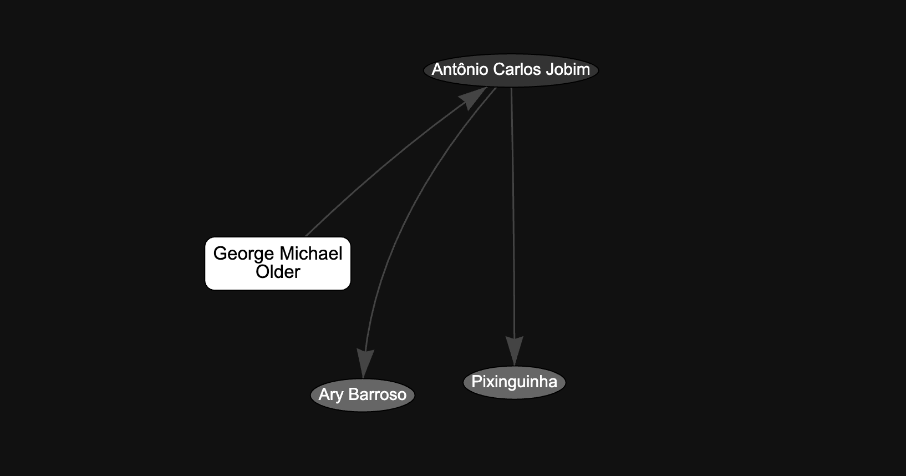

# Bloodline
Music discovery through influence, not algorithm.

George Michael said Wave (1967) by Antonio Carlos Jobim
was one of his strongest inspirations behind Older (1996).
Thirty years apart, different genres — same mood.
No algorithm connects them. Neither do modern AI models — until you train one on real influence data.

This is an attempt to connect them through real influence —
not just genre labels. And to prove it works by training a model that sees what others miss.


*Early sample: albums → depth=1 artists → depth=2 artists. Built automatically from Wikipedia via LLM extraction.*


**Is this who you are?**

You don't just listen to music — you think about it.
You read liner notes. You dig through discographies.
You watch interviews to understand why an album sounds the way it does.

You want to know not what's similar — but what's connected.
Where it came from. What it spawned. Why it exists.

This is built for you.


**How it works**

Each source (Wikipedia article, Pitchfork review, interview) is stored separately in the DB — so extraction can be re-run per source when the model or prompt changes, without re-fetching.

1. RateYourMusic Top 5000 → seed list of albums + mood descriptors
2. step1 → fetch Wikipedia text for albums and influence artists, store raw in `sources`
3. step2 → LLM extracts the "juice" from each source: influences, mood, context → stored as JSON
4. step3 → builds influence graph from extracted data, discovers new artists → back to step1
5. Two passes cover depth=2: album→artist→artist
6. SQLite graph → `album→artist` (depth=1), `artist→artist` (depth=2)
7. Next.js → UI + API routes

**Stack**


<details>
<summary>Scripts</summary>

Run two passes to cover depth=2:

```bash
cd scripts
python step1_collect.py        # fetch Wikipedia → sources (albums + any new artists)
python step2_extract.py        # LLM extraction → extracted_json in sources
python step3_build_graph.py    # build edges, register new influence artists
python step1_collect.py        # fetch Wikipedia for new artists (depth=2)
python step2_extract.py        # LLM extraction for depth=2 artists
python step3_build_graph.py    # complete the graph
```

**step1_collect.py** — reads `source/rym_clean1.csv`, fetches Wikipedia for each album. Also fetches Wikipedia for any artists registered by step3 that haven't been fetched yet. Saves raw text to `sources` table, sets `fetched=1`. Skips already fetched.

**step2_extract.py** — reads all sources with `fetched=1, extracted=0`, sends wiki text in paragraph-based chunks (up to 8000 chars) to Ollama (qwen2.5:7b). Extracts artists cited as musical influences. Saves JSON to `extracted_json`, sets `extracted=1`, records model and prompt version.

**step3_build_graph.py** — reads `extracted_json` from all processed sources, creates artist nodes in `artists` table, writes edges: `album→artist` (depth=1), `artist→artist` (depth=2). Does not fetch or extract — only builds the graph.

**wiki.py** — shared Wikipedia fetch logic used by step1 and step3. Handles retries and rate limiting.

**export_labeling.py** — exports extracted influences from sources into `data/labeling.csv` for manual review. Appends only new rows, preserving existing labels.

**prepare_finetune.py** — converts labeled CSV into `data/finetune.jsonl` (chat format) for QLoRA fine-tuning.

**get_photo_wi.py** — utility to fetch artist/album photo from Wikipedia (Wikimedia Commons only).

</details>

<details>
<summary>Setup</summary>

```bash
npm install
npm run dev
```

```bash
cd scripts
pip install -r requirements.txt
```

</details>

<details>
<summary>Roadmap</summary>

**v1 — Influence Graph**
- [x] RateYourMusic Top 5000 → album list + mood descriptors
- [x] Wikipedia API → fetch wiki text per album and per influence artist
- [x] LLM (Ollama) → extract musical influences from each source independently
- [x] Recursive expansion (depth=2) — step1→step2→step3 run twice
- [x] SQLite graph — albums + artists + sources + edges
- [x] Per-source storage — each source tracked separately (fetched/extracted flags, model, prompt version)
- [x] Labeled dataset (673 examples) for extraction fine-tune
- [ ] Fine-tune Qwen 2.5:7b (QLoRA) → cleaner influence extraction
- [ ] LanceDB → embeddings for semantic search (Nomic via Ollama)
- [ ] Next.js API routes → search + graph traversal
- [ ] Basic UI → search by album, see influence chain

**v2 — Fine-tuned Embedding Model**

Baseline (nomic-embed-text): Older ↔ Wave → cosine similarity ~0.12.
After fine-tuning on the influence graph: ~0.87. The model learned that influence = proximity.

- [ ] Build training dataset — positive pairs (A influenced B), negative pairs (random)
- [ ] Fine-tune nomic-embed-text via QLoRA (RTX 3060 6GB)
- [ ] Evaluate cosine similarity before/after on known influence pairs
- [ ] Publish to HuggingFace
- [ ] Replace base model in v1

**Future**
- [ ] Mobile (Expo)

</details>
